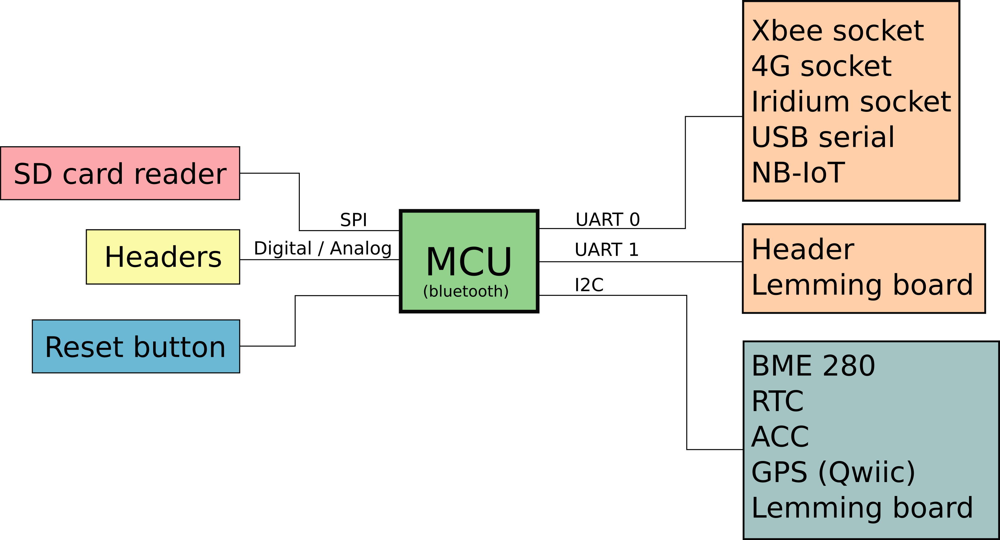

# Design of the UiO OSlogger

S. Filhol, June 2019

This documents highlights the design guidelines and requirements for a full open-source (hardware and software) data logger for Wireless Sensor Network (WSN) application in cold and remote regions. Inspired by [Arduino](https://www.arduino.cc/), and the Waspmote from [Libelium](http://www.libelium.com/products/waspmote/), the goal is to build a core platform with power management, computational power, sensor interface, and a variety of wireless communication systems. The core design principle should follow power efficiency, simplicity and flexibility for fast and easy integration of accessories (sensors), just like Arduino's board. The objective for this platform is to be used for weather station system, but also quick and easy implementation of small projects (e.g. student project).

Some existing projects  approaching this philosophy are the [MayflyDIY](https://www.envirodiy.org/mayfly/) system, the [Loom Project](https://www.open-sensing.org/project-loom), the [Maixduino](https://www.seeedstudio.com/Sipeed-Maixduino-Kit-for-RISC-V-AI-IoT-p-4047.html), or [Seeed Stalker](https://www.seeedstudio.com/category/Arduino-c-1001/category/Arduino-Compatible-c-11/seeeduino-boards-c-987/Seeeduino-Stalker-V3-1-p-2686.html). While all of them show interesting features, none present the full list of requirements needed to tackle data logging and communication in cold and remote regions. 

## General Architecture

The overall design consists of three main parts: 

1. **The logger board** with a microprocessor, on board accessories, as well as port to plug additional accessories (GPS, radio module, 4G, or Iridium). This logger board should be design with the same spirit an Arduino is designed, being independent and flexible for the broadest application to collect, log and send data and control other devices. The core parts will then consist of:
   - a microprocessor, compatible with Arduino compiler, with >250KB of flash memory, an EEPROM memory, an if possible bluetooth communication (optional) for future data collection system, UART, I2C. Compatible with 3.3V power supply. A good pick might be the one used with [Arduino nano BLE 33](https://store.arduino.cc/nano-33-ble), or ESP32
   - a clock RTC with coin cell and watchdog
   - a SD card reader
   - a USB adapter (to push programs to processor via the Arduino)
   - sensors:
     -  accelerometer I2C sensor
     - a temperature and humidity I2C sensor (e.g. BME280)
   - a power system to power the microprocessor, and all other devices with 3.3V and 5V capabilities. The power system should be based on Lithium battery packs, solar and USB charging capabilities. Sensors like SDI12 ones from Decagon require 5V, so a voltage regulator providing 5V is needed. These sensors also have the data line running in 5V, something to consider when connecting to the microprocessor. Possibility to add two lithium battery pack in parallel.
   - communication ports, with adapted ports for:
     - [2.4GHz Xbee radio](https://www.digi.com/products/embedded-systems/rf-modules/2-4-ghz-modules/xbee-digimesh-2-4) module or the [868 MHz Xbee](https://www.digi.com/products/embedded-systems/rf-modules/sub-1-ghz-modules/digi-xbee-sx-868) module
     - GPRS module (e.g. [seeedstudio](https://www.seeedstudio.com/GPRS-Shield-V2-0-p-1379.html), [cookinghacks](https://www.cooking-hacks.com/gsm-gprs-waspmote-module), or [nimbelink](https://nimbelink.com/products/skywire-arduino-cellular-shield/))
     - Iridium module ([rockblock 9603](http://www.rock7mobile.com/products-rockblock-9603))
     - QWIIC connector for [Sparkfun GPS module](https://www.sparkfun.com/products/15210)
     - headers for Lemming board (see below)
   - buttons: 
     - reset, to reboot the processor
     - ON/OFF
2. **The Lemming board**, which purpose is to create an interface in between the main logger board, and the  various sensor. The board should include I2C isolator and multiplexer, an ADC converter (if none in the microprocessor), SDI 12 ports (with 5V power supply as well as 5V data line), and OneWire capability (for chain of thermistors).
3. **The sensors,** which can be commercial, or self-made, such as the Lagopus.

The overall package should be compact in size.

The MCU and its surrounding device data lines could follow the following architecture:

As a basis for the electronic design, a good inspiration is the MayFly schematic. The overall idea is laid out in this design to the exception of components like the MCU that would need to be changed, and it will involved:

## Software

One key requirement is that the hardware can be programmed using the Arduino language and compiler, that designing custom code, and integrating new devices is just as easy as with an Arduino board. Then, a second goal is to transfer the current software developed for Waspmote to this new system for deployment of base WSN.   

Current Github repository for the WSN code, waspmote based: https://github.com/spectraphilic/wasp_sketches

Currently we use the concept of frames to carry information . This could be transfered to the new software as well.

## Accessories to build

1.  [868 MHz Xbee](https://www.digi.com/products/embedded-systems/rf-modules/sub-1-ghz-modules/digi-xbee-sx-868) module with headers and antenna threaded plug compatible with other xbee socket.
2. Lemming board
3. Lagopus board

## Road Map

1. redesign Lemming board compatible with waspmote
2. Launch design for OSlogger:
   1. decide which microprocessor
   2. decide key components (RTC, sd reader, ACC, PWR system...)
   3. produce first electronic schematic and board layout
   4. build breadboard prototype, develop firmware
   5. Manufacturing first version
   6. Adapt code to the new board
3. Redesign Lagopus, and lemming accordingly to new board packaging